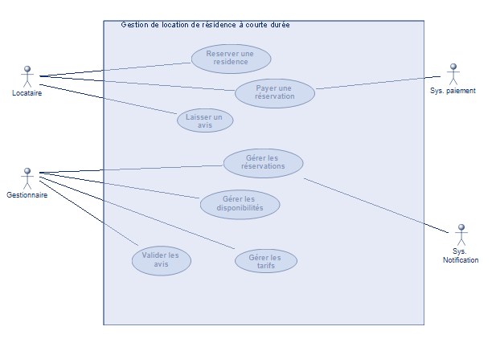

Ce diagramme représente le système de "Gestion de location de résidence à courte durée". Il met en évidence les différentes fonctionnalités offertes par ce système et les acteurs qui interagissent avec lui.

**Acteurs**

* **Locataire :** Représenté par un bonhomme à gauche, il symbolise l'utilisateur qui souhaite louer une résidence.
* **Gestionnaire :** Également représenté par un bonhomme à gauche, il s'agit de la personne qui gère les locations.
* **Sys. paiement :** Un acteur externe (à droite) représentant le système de paiement utilisé pour les transactions.
* **Sys. Notification :** Un autre acteur externe (à droite) représentant le système de notification 
(pour les confirmations, rappels, etc.).

**Cas d'utilisation**

Les ovales à l'intérieur du rectangle représentent les cas d'utilisation, c'est-à-dire les actions que les acteurs peuvent effectuer avec le système :

* **Pour le Locataire :**
    * **Réserver une résidence :** La fonctionnalité principale de recherche et de réservation de logements.
    * **Payer une réservation :** Le processus de paiement en ligne qui fait appel au système de paiement externe.
    * **Laisser un avis :** La possibilité pour le locataire de donner son opinion sur son séjour.
* **Pour le Gestionnaire :**
    * **Gérer les réservations :** Visualiser, modifier ou annuler les réservations.
    * **Gérer les disponibilités :** Mettre à jour le calendrier des logements disponibles.
    * **Valider les avis :** Modérer les avis laissés par les locataires.
    * **Gérer les tarifs :** Modifier les prix des logements.

