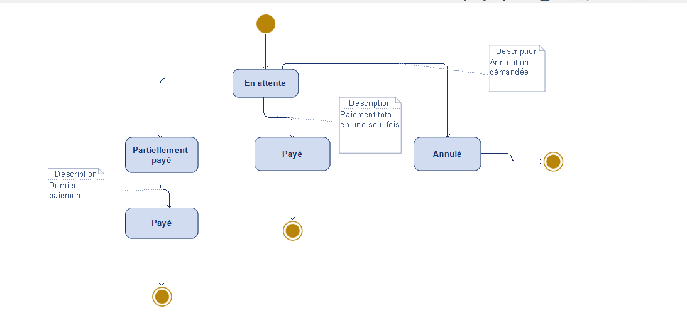

**Diagramme d'état : Réservation**

* Ce diagramme illustre le processus de paiement d'une réservation, depuis l'attente initiale jusqu'à la finalisation ou l'annulation.
* Il détaille les états possibles : "En attente", "Partiellement payé", "Payé" et "Annulé".
* Les transitions sont déclenchées par des actions de paiement (paiement partiel, paiement total) ou une demande d'annulation.
* Il met en évidence les différentes étapes du paiement et les options possibles pour le client.
* Ce diagramme permet de comprendre le flux de paiement et les statuts associés à une réservation.
