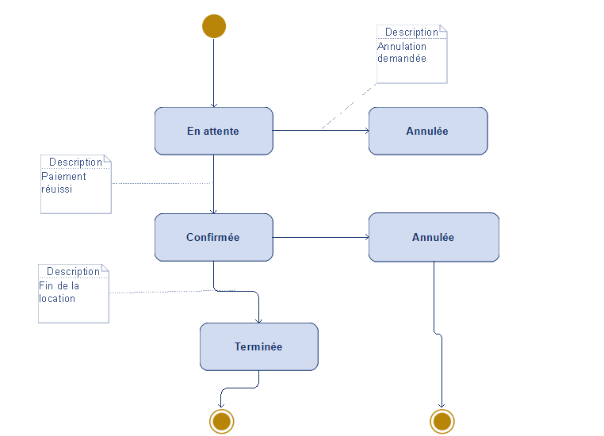

**Diagramme d'état : Paiement de Réservation**

* Ce diagramme illustre le cycle de vie d'une réservation, de la création à la finalisation ou l'annulation.
* Il détaille les états possibles : "En attente", "Confirmée", "Terminée", et "Annulée".
* Les transitions entre les états sont déclenchées par des événements spécifiques (paiement, demande d'annulation, fin de location).
* Il offre une vue claire des différents statuts d'une réservation et de leurs enchaînements.
* Ce diagramme permet de comprendre et documenter le flux de gestion des réservations.
