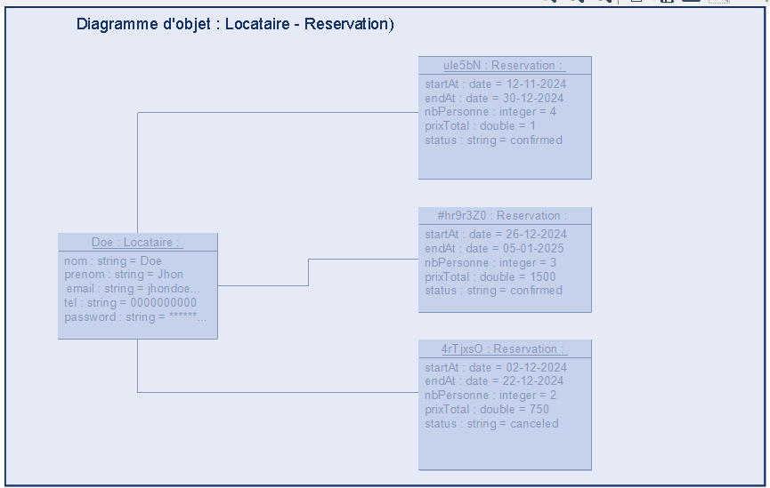

**Diagramme d'objets : Locataire - Réservation**

Ce diagramme d'objets présente une vue instantanée des instances de classes `Locataire` et `Réservation` dans le contexte d'un système de gestion de locations. Il illustre les relations entre un locataire spécifique (Doe Jhon) et ses réservations associées.

Le diagramme permet de visualiser les attributs et les valeurs spécifiques des objets `Locataire` et `Réservation` à un moment donné.
Il montre comment un locataire est lié à ses réservations, facilitant la compréhension des interactions entre ces entités.
Le diagramme sert d'exemple pour illustrer l'instanciation des classes et la manière dont les données sont stockées dans le système.

* Une association relie l'objet `Doe Locataire` aux trois objets `Réservation`, indiquant que ces réservations sont liées à ce locataire, donc un locataire peut faire plusieurs réservations mais une réservation n'est lié qu'à un seul locataire .

