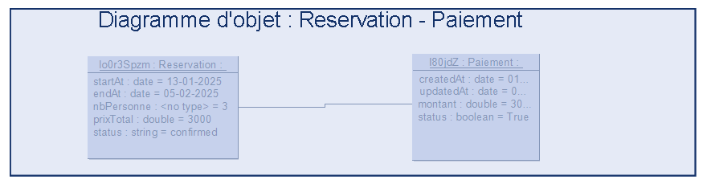

**Diagramme d'objets : Reservation - Paiement**

Ce diagramme d'objets présente une vue instantanée des instances de classes `Paiement` et `Réservation` dans le contexte d'un système de gestion de locations. Il illustre les relations entre une réservation et un Paiement.

Le diagramme permet de visualiser les attributs et les valeurs spécifiques des objets `Paiement` et `Réservation` à un moment donné.
Il montre comment un Paiement est lié à une réservation, facilitant la compréhension des interactions entre ces entités.
Le diagramme sert d'exemple pour illustrer l'instanciation des classes et la manière dont les données sont stockées dans le système.

* Une association relie l'objet `Paiement` à l'objet `Réservation`, indiquant qu'une réservation est liée à ce Paiement( En plusieurs fois ou en une seul fois, puisque dans le sytème on aimerait enregistrer la date du paiement et la date du dernier paiement et incrementer le montant avec le bon status du paiement).