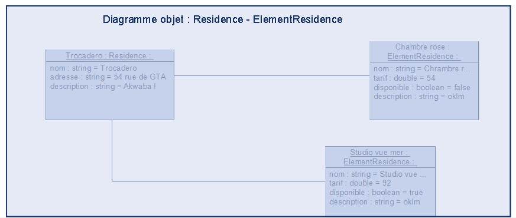

**Diagramme d'objets : Résidence - ElementResidence**

Ce diagramme d'objets présente une vue instantanée des instances de classes `Résidence` et `ElementResidence` dans le contexte d'un système de gestion de locations. Il illustre les relations entre une résidence spécifique et ses Element de Residences associées.

Le diagramme permet de visualiser les attributs et les valeurs spécifiques des objets `Résidence` et `ElementResidence` à un moment donné.
Il montre comment une résidence est lié à ses ElementResidences, facilitant la compréhension des interactions entre ces entités.
Le diagramme sert d'exemple pour illustrer l'instanciation des classes et la manière dont les données sont stockées dans le système.

* Une association relie l'objet `Résidence` aux deux objets `ElementResidence`, indiquant que ces ElementResidences sont liées à ce Résidence et une résidence peut avoir plusieurs elementsResidence comme <<Chambre rose>>, <<Studio vue mer>>, etc..., de même une résidence peut avoir plusieurs materiels et prestations.