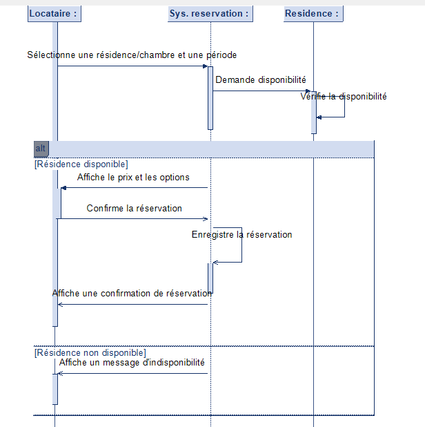

**Diagramme de séquence de réservation de résidence**

Ce diagramme de séquence illustre le processus de réservation d'une résidence par un locataire, en interagissant avec un système de réservation.

**Acteurs :**

* **Locataire :** La personne qui souhaite réserver une résidence.
* **Système de réservation :** L'application ou le service qui gère les réservations.
* **Résidence :** La résidence ou la chambre que le locataire souhaite réserver.

**Étapes du processus :**

1.  **Sélection de la résidence et de la période :** Le locataire commence par choisir la résidence ou la chambre souhaitée, ainsi que les dates de séjour.
2.  **Demande de disponibilité :** Le locataire envoie une demande de disponibilité au système de réservation.
3.  **Vérification de la disponibilité :** Le système de réservation vérifie si la résidence est disponible pour la période demandée.
4.  **Résultat de la disponibilité :**
    * **Résidence disponible :**
        * Le système affiche le prix et les options disponibles pour la résidence.
        * Le locataire confirme la réservation.
        * Le système enregistre la réservation.
        * Le système affiche une confirmation de réservation au locataire.
    * **Résidence non disponible :**
        * Le système affiche un message indiquant que la résidence n'est pas disponible.

