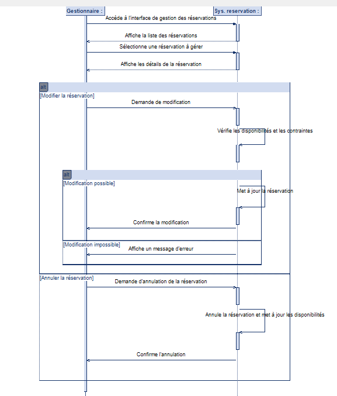

**Diagramme de séquence de gestion des réservations par le gestionnaire**

Ce diagramme de séquence illustre le processus par lequel un gestionnaire modifie ou annule des réservations via un système de réservation.

**Acteurs :**

* **Gestionnaire :** La personne responsable de la gestion des réservations.
* **Système de réservation :** L'application ou le service qui gère les réservations.

**Étapes du processus :**

1.  **Accès à l'interface de gestion :** Le gestionnaire accède à l'interface de gestion des réservations.
2.  **Affichage des réservations :** Le système de réservation affiche la liste des réservations.
3.  **Sélection d'une réservation :** Le gestionnaire sélectionne une réservation à gérer.
4.  **Affichage des détails :** Le système de réservation affiche les détails de la réservation.
5.  **Modification ou annulation :**
    * **Modification de la réservation :**
        * Le gestionnaire demande une modification.
        * Le système vérifie les disponibilités et les contraintes.
        * **Modification possible :**
            * Le système met à jour la réservation.
            * Le système confirme la modification.
        * **Modification impossible :**
            * Le système affiche un message d'erreur.
    * **Annulation de la réservation :**
        * Le gestionnaire demande l'annulation de la réservation.
        * Le système annule la réservation et met à jour les disponibilités.
        * Le système confirme l'annulation.
