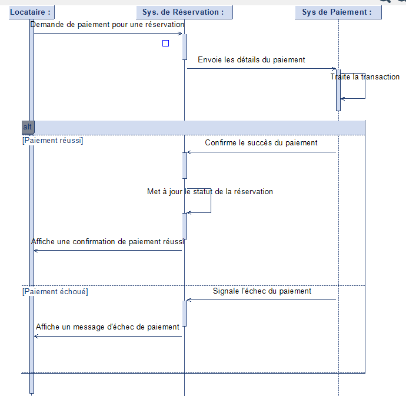

**Diagramme de séquence du processus de paiement pour une réservation**

Ce diagramme de séquence illustre le processus de paiement pour une réservation effectuée par un locataire, en interagissant avec un système de réservation et un système de paiement.

**Acteurs :**

* **Locataire :** La personne qui effectue le paiement pour sa réservation.
* **Système de réservation :** L'application ou le service qui gère les réservations et initie le processus de paiement.
* **Système de paiement :** Le service externe qui traite les transactions de paiement.

**Étapes du processus :**

1.  **Demande de paiement :** Le locataire ou le système de réservation initie une demande de paiement pour la réservation.
2.  **Envoi des détails de paiement :** Le système de réservation envoie les détails de paiement nécessaires au système de paiement.
3.  **Traitement de la transaction :** Le système de paiement traite la transaction.
4.  **Résultat du paiement :**
    * **Paiement réussi :**
        * Le système de paiement confirme le succès du paiement au système de réservation.
        * Le système de réservation met à jour le statut de la réservation.
        * Le système de réservation affiche une confirmation de paiement réussi au locataire.
    * **Paiement échoué :**
        * Le système de paiement signale l'échec du paiement au système de réservation.
        * Le système de réservation affiche un message d'échec de paiement au locataire.

