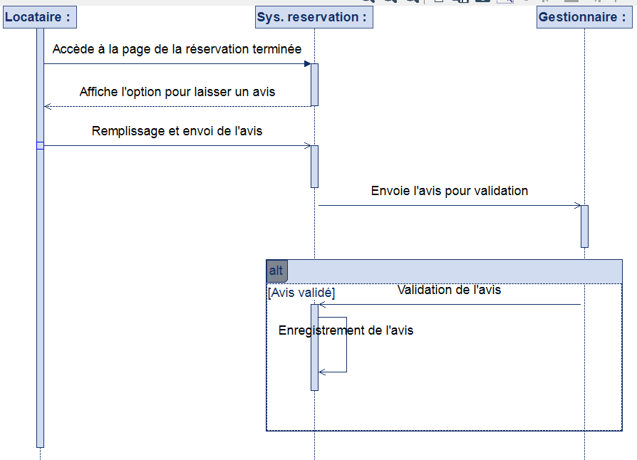

**Diagramme de séquence de soumission d'avis pour une réservation terminée**

Ce diagramme de séquence illustre le processus par lequel un locataire soumet un avis après la fin de sa réservation, en interagissant avec un système de réservation et un gestionnaire. Il met en évidence les différentes étapes, les acteurs impliqués et les flux de communication entre eux.

**Acteurs :**

* **Locataire :** La personne qui souhaite laisser un avis après sa réservation.
* **Système de réservation :** L'application ou le service qui gère les réservations et les avis.
* **Gestionnaire :** La personne ou le système qui valide et enregistre les avis.

**Étapes du processus :**

1.  **Accès à la page de réservation terminée :** Le locataire accède à la page de sa réservation terminée.
2.  **Affichage de l'option d'avis :** Le système de réservation affiche une option permettant au locataire de laisser un avis.
3.  **Remplissage et envoi de l'avis :** Le locataire remplit et envoie son avis.
4.  **Envoi de l'avis pour validation :** Le système de réservation envoie l'avis au gestionnaire pour validation.
5.  **Résultat de la validation de l'avis :**
    * **Avis validé :**
        * Le gestionnaire valide l'avis.
        * Le système de réservation enregistre l'avis.

