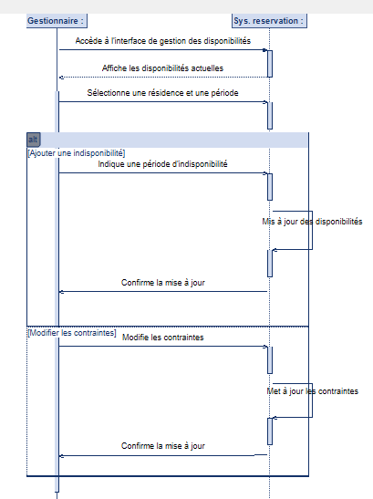

**Diagramme de séquence de gestion des disponibilités et des contraintes**

Ce diagramme de séquence illustre le processus par lequel un gestionnaire modifie les disponibilités et les contraintes d'une résidence via un système de réservation. 

**Acteurs :**

* **Gestionnaire :** La personne responsable de la gestion des disponibilités et des contraintes des résidences.
* **Système de réservation :** L'application ou le service qui gère les résidences et leurs paramètres.

**Étapes du processus :**

1.  **Accès à l'interface de gestion :** Le gestionnaire accède à l'interface de gestion des disponibilités.
2.  **Affichage des disponibilités :** Le système de réservation affiche les disponibilités actuelles.
3.  **Sélection de la résidence et de la période :** Le gestionnaire sélectionne la résidence et la période concernées.
4.  **Modification (Ajout d'indisponibilité ou modification des contraintes) :**
    * **Ajout d'indisponibilité :**
        * Le gestionnaire indique une période d'indisponibilité.
        * Le système met à jour les disponibilités.
        * Le système confirme la mise à jour au gestionnaire.
    * **Modification des contraintes :**
        * Le gestionnaire modifie les contraintes.
        * Le système met à jour les contraintes.
        * Le système confirme la mise à jour au gestionnaire.
