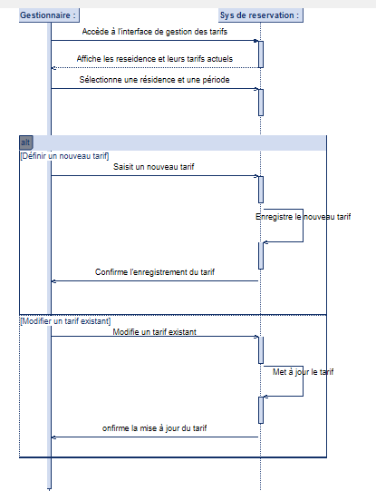

**Diagramme de séquence de gestion des tarifs des résidences**

Ce diagramme de séquence illustre le processus par lequel un gestionnaire modifie les tarifs des résidences via un système de réservation.

**Acteurs :**

* **Gestionnaire :** La personne responsable de la gestion des tarifs des résidences.
* **Système de réservation :** L'application ou le service qui gère les résidences et leurs tarifs.

**Étapes du processus :**

1.  **Accès à l'interface de gestion :** Le gestionnaire accède à l'interface de gestion des tarifs.
2.  **Affichage des tarifs :** Le système de réservation affiche les résidences et leurs tarifs actuels.
3.  **Sélection de la résidence et de la période :** Le gestionnaire sélectionne la résidence et la période concernées.
4.  **Modification (Définition d'un nouveau tarif ou modification d'un tarif existant) :**
    * **Définition d'un nouveau tarif :**
        * Le gestionnaire saisit un nouveau tarif.
        * Le système enregistre le nouveau tarif.
        * Le système confirme l'enregistrement du tarif au gestionnaire.
    * **Modification d'un tarif existant :**
        * Le gestionnaire modifie un tarif existant.
        * Le système met à jour le tarif.
        * Le système confirme la mise à jour du tarif au gestionnaire.

